### 配置LeanCloud(为next主题添加阅读统计功能)

在注册完成LeanCloud帐号并验证邮箱之后，我们就可以登录我们的LeanCloud帐号，进行一番配置之后拿到`AppID`以及`AppKey`这两个参数即可正常使用文章阅读量统计的功能了。


<!--more-->
#### 创建应用

- 我们新建一个应用来专门进行博客的访问统计的数据操作。首先，打开控制台，如下图所示：

  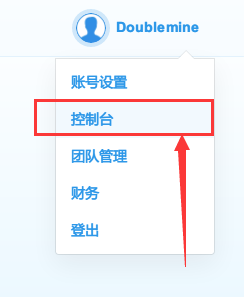

打开控制台

- 在出现的界面点击`创建应用`：

  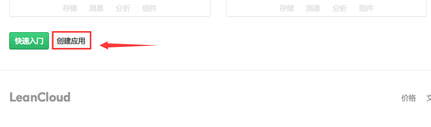

创建应用

- 在接下来的页面，新建的应用名称我们可以随意输入，即便是输入的不满意我们后续也是可以更改的:

  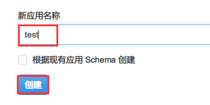

创建的新应用名称

- 这里为了演示的方便，我新创建一个取名为test的应用。创建完成之后我们点击新创建的应用的名字来进行该应用的参数配置：

  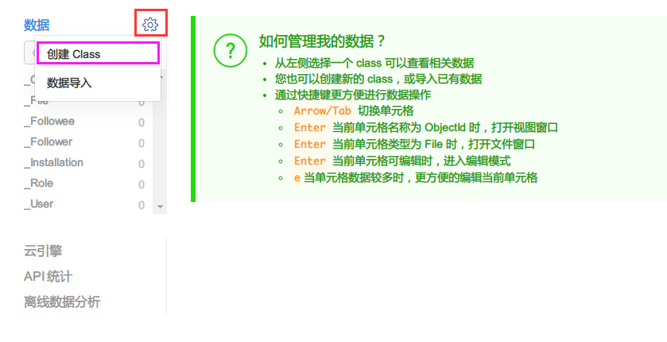

打开应用参数配置界面

- 在应用的数据配置界面，左侧下划线开头的都是系统预定义好的表，为了便于区分我们新建一张表来保存我们的数据。点击左侧右上角的齿轮图标，新建Class：
  在弹出的选项中选择`创建Class`来新建Class用来专门保存我们博客的文章访问量等数据:
  点击`创建Class`之后，为了保证我们前面对NexT主题的修改兼容，此处的**新建Class名字必须为Counter**:

  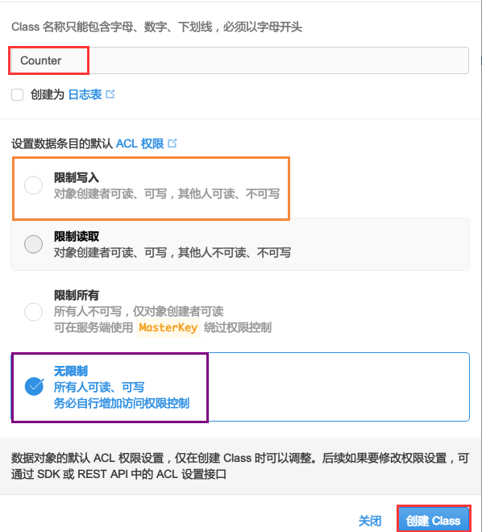

权限配置

- 由于LeanCloud升级了默认的ACL权限，如果你想避免后续因为权限的问题导致次数统计显示不正常，建议在此处选择`无限制`。

  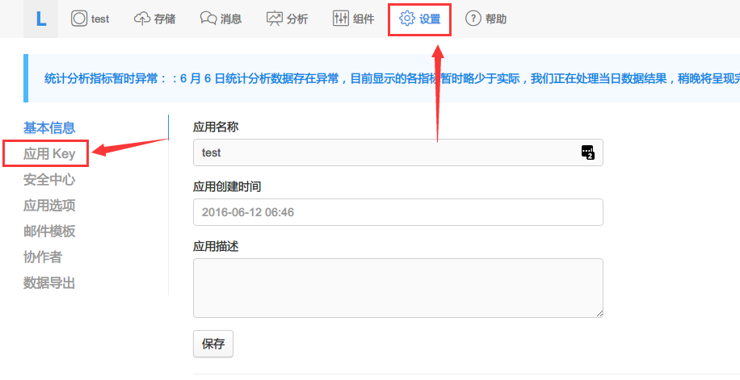

打开应用设置

创建完成之后，左侧数据栏应该会多出一栏名为`Counter`的栏目，这个时候我们点击顶部的设置，切换到test应用的操作界面:
在弹出的界面中，选择左侧的`应用Key`选项，即可发现我们创建应用的`AppID`以及`AppKey`，有了它，我们就有权限能够通过主题中配置好的Javascript代码与这个应用的Counter表进行数据存取操作了:

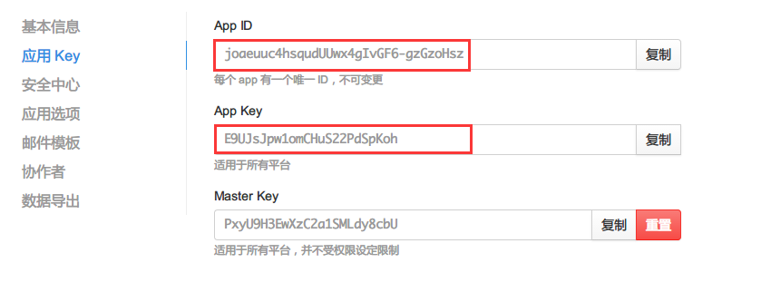

获取Appid、Appkey

复制`AppID`以及`AppKey`并在NexT主题的`_config.yml`文件中我们相应的位置填入即可，正确配置之后文件内容像这个样子:

```
leancloud_visitors:
  enable: true
  app_id: joaeuuc4hsqudUUwx4gIvGF6-gzGzoHsz
  app_key: E9UJsJpw1omCHuS22PdSpKoh
```

这个时候重新生成部署Hexo博客，应该就可以正常使用文章阅读量统计的功能了。需要特别说明的是：记录文章访问量的唯一标识符是文章的`发布日期`以及`文章的标题`，因此请确保这两个数值组合的唯一性，如果你更改了这两个数值，会造成文章阅读数值的清零重计。

#### 后台管理

当你配置部分完成之后，初始的文章统计量显示为0，但是这个时候我们LeanCloud对应的应用的`Counter`表中并没有相应的记录，只是单纯的显示为0而已，当博客文章在配置好阅读量统计服务之后第一次打开时，便会自动向服务器发送数据来创建一条数据，该数据会被记录在对应的应用的`Counter`表中。

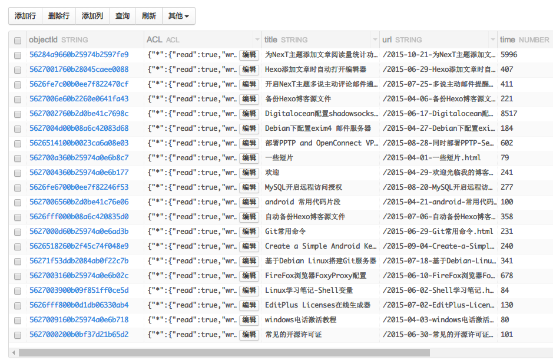

后台管理

我们可以修改其中的`time`字段的数值来达到修改某一篇文章的访问量的目的（博客文章访问量快递提升人气的装逼利器）。双击具体的数值，修改之后回车即可保存。

- `url`字段被当作唯一`ID`来使用，因此如果你不知道带来的后果的话请不要修改。
- `title`字段显示的是博客文章的标题，用于后台管理的时候区分文章之用，没有什么实际作用。
- 其他字段皆为自动生成，具体作用请查阅LeanCloud官方文档，如果你不知道有什么作用请不要随意修改。

#### Web安全

因为AppID以及AppKey是暴露在外的，因此如果一些别用用心之人知道了之后用于其它目的是得不偿失的，为了确保只用于我们自己的博客，建议开启Web安全选项，这样就只能通过我们自己的域名才有权访问后台的数据了，可以进一步提升安全性。

选择应用的设置的`安全中心`选项卡:

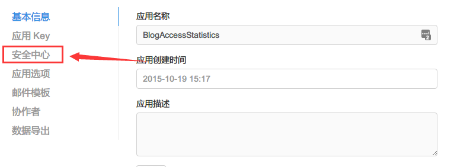

进入安全中心

在`Web 安全域名`中填入我们自己的博客域名，来确保数据调用的安全:

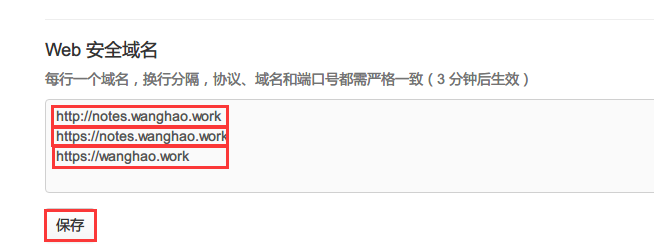

锁定域名

如果你不知道怎么填写安全域名而或者填写完成之后发现博客文章访问量显示不正常，打开浏览器调试模式，发现如下图的输出:

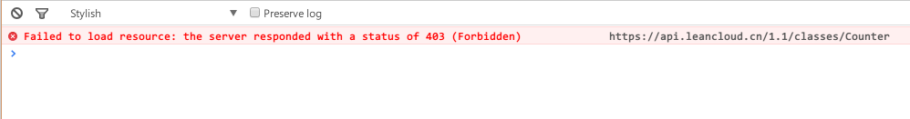

Web安全域名填写错误

这说明你的安全域名填写错误，导致服务器拒绝了数据交互的请求，你可以更改为正确的安全域名或者你不知道如何修改请在本博文中留言或者放弃设置Web安全域名。

[参考地址](https://notes.wanghao.work/2015-10-21-%E4%B8%BANexT%E4%B8%BB%E9%A2%98%E6%B7%BB%E5%8A%A0%E6%96%87%E7%AB%A0%E9%98%85%E8%AF%BB%E9%87%8F%E7%BB%9F%E8%AE%A1%E5%8A%9F%E8%83%BD.html#%E9%85%8D%E7%BD%AELeanCloud)

### 增加网站的浏览次数与访客数量统计功能

网站的浏览次数，即`pv`；网站的访客数为`uv`。`pv`的计算方式是，单个用户连续点击n篇文章，记录n次访问量；`uv`的计算方式是，单个用户连续点击n篇文章，只记录1次访客数。你可以根据需要添加相应的统计功能。

#### 安装`busuanzi.js`脚本

如果你使用的是NexT主题（其他主题类似），打开`/theme/next/layout/_partial/footer.swig`文件，拷贝下面的代码至文件的开头。

```
<script async src="https://dn-lbstatics.qbox.me/busuanzi/2.3/busuanzi.pure.mini.js">
</script>
```

#### 显示统计标签

同样编辑`/theme/next/layout/_partial/footer.swig`文件。

如果你想要显示`pv`统计量，复制以下代码至你想要放置的位置，

```
<span id="busuanzi_container_site_pv">
    本站总访问量<span id="busuanzi_value_site_pv"></span>次
</span>
```

如果你想要显示`uv`统计量，复制以下代码至你想要放置的位置，

```
<span id="busuanzi_container_site_uv">
  本站访客数<span id="busuanzi_value_site_uv"></span>人次
</span>
```

[参考地址](http://www.jeyzhang.com/hexo-next-add-post-views.html)

### 自动刷新

经常本地调试 Hexo 主题, 如果有工具能监视文件更改幷自动刷新页面，那一定能提高不少效率， [Browsersync](http://www.browsersync.cn/)就是这样一款浏览器同步测试工具。

#### 安装 Browsersync

- Browsersync 依赖包较多，Mac 和 Linux 中建议加上 `sudo` 避免安装时因权限不足而报错

```
npm install -g browser-sync
```

- 安装结束后执行下面命令，能显示对应版本则表示安装成功

```
browser-sync --version
```

如果显示无此命令，请尝试使用 [淘宝 NPM 镜像](http://npm.taobao.org/) ，或者全局科学上网后再安装

#### 安装 Hexo 端插件

- 要把 Browsersync 应用到 Hexo 上，还需要安装一个小插件 [hexo-browsersync](https://github.com/hexojs/hexo-browsersync)。命令行中进入 Hexo 根目录，执行以下命令:

```
npm install hexo-browsersync --save
```

- 安装后像往常一样执行 `hexo s` 开启本地服务器，当相关文件被修改或者保存时，关联的浏览器页面会自带刷新

[参考地址](http://www.tuicool.com/articles/3ieIref)

### 阅读全文的显示

```
<!--more --> 在你需要断文处加上次注释，之后的就会被隐藏病显示一个阅读全文的按钮，注释前可以写你的描述
```

### 在 hexo 中无痛使用本地图片

#### 1 起因

在 hexo 中使用本地图片是件非常让人纠结的事情，在 markdown 里的图片地址似乎永远无法和最后生成的网页保持一致。

这些问题使得我一度不愿意使用本地图片而选择用图床，但被移动运营商无耻的横条广告逼得打算上 https，图床只支持 http 就成了问题。

hexo 下插入图片现在大概有几个方案

#### 1.1 放在根目录

早期大部分的方案是把图片放在 `source/img` 下，然后在 markdown 里写 `` 。显然这样在本地的编辑器里完全不能正确识别图片的位置。

#### 1.2 asset-image

在 hexo 2.x 时出现的插件，后来被吸纳进 `hexo 3 core` ，用法的介绍见 [资源文件夹 | Hexo](https://hexo.io/zh-cn/docs/asset-folders.html) 。比较尴尬的是，这种方法直接放弃了 markdown 原来的语法，使用类似 ``的语法，。markdown 本来有插入图片的语法不好好支持，专门用一个新的语法来插入本地图片，让我这种强迫症不太能接受。

#### 2 解决方案

[CodeFalling/hexo-asset-image](https://github.com/CodeFalling/hexo-asset-image)

#### 2.1 使用

首先确认 `_config.yml` 中有 `post_asset_folder:true` 。

在 hexo 目录，执行

```
npm install https://github.com/CodeFalling/hexo-asset-image --save
```

假设在

```
MacGesture2-Publish
├── apppicker.jpg
├── logo.jpg
└── rules.jpg
MacGesture2-Publish.md
```

这样的目录结构（目录名和文章名一致），只要使用 ``就可以插入图片。

生成的结构为

```
public/2015/10/18/MacGesture2-Publish
├── apppicker.jpg
├── index.html
├── logo.jpg
└── rules.jpg
```

同时，生成的 html 是

```

```

而不是愚蠢的

```

```

值得一提的是，这个插件对于 [CodeFalling/hexo-renderer-org](https://github.com/CodeFalling/hexo-renderer-org) 同样有效。

[参考1](http://www.tuicool.com/articles/umEBVfI)

[参考2](https://hexo.io/zh-cn/docs/asset-folders.html)